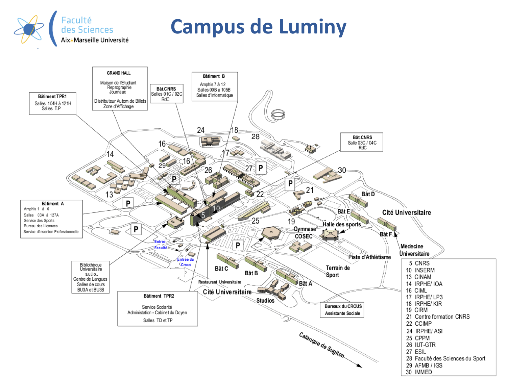
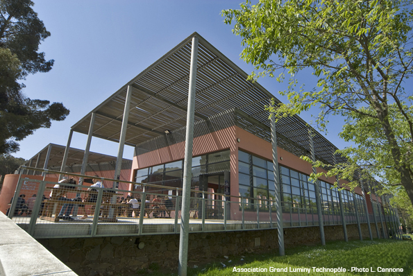

## Practical organisation

### Going to Marseille

1. By plane : MRS [Aéroport Marseille Provence](https://www.marseille-airport.com/)

2. By Train : Marseille train station [(Gare Saint Charles)](https://www.raileurope-world.com/place/marseille-saint-charles)

### Going to the Venue (Luminy Campus)

1. From Airport to Train station 

The Luminy Campus is located 40 km from Marseille airport (MRS) [Aéroport Marseille Provence](https://www.marseille-airport.com/). Airport-Institute by bus+subway (1 hour and 30 minutes) :

- [Shuttle Airport / Marseille train station (gare Saint Charles)](https://www.marseille-airport.com/access-car-parks/access/by-train-or-by-bus)  (gare Saint Charles) (shuttle every 20 minutes)
Ticket price : ~8 euros 
- Airport-Luminy Campus by taxi (1 hour) :
Price: around 65 euros (day price) to 80 euros (night price)

2. Once in Marseille: By metro and bus

- *Bus B1* (From Castellane - Campus de Luminy). Opportunity to take the rond point du Prado in correspondence with the Metro 2 Bougainville-Ste Marguerite/Dromel.
- *Bus 21J* (JET BUS) (From Rond-Point du Prado - Campus de Luminy). Only during school times, in correspondence with the Metro 2 Bougainville-Ste Marguerite/Dromel.
- *Bus 24 or 24B* (From Ste Marguerite/Dromel - Campus de Luminy). In correspondence with the Metro 2 Bougainville-Ste Marguerite/Dromel.
- INFO: The metro lines 1 and 2 operate from 5h00 to 00h30 all the week.
- [Marseille Bus Maps](http://www.rtm.fr/en/travellers-guide/getting-around/maps)
- [Marseille Metro Map PDF](http://www.rtm.fr/en/travellers-guide/getting-around/maps)

### Luminy Campus it's

- 2 Faculties, 6 Grandes Ecoles et Instituts (more than 8000 students)
- 32 Research laboratories CNRS, INSERM, University, INRA, IRD, CEA (more than 1500 researchers, foreign post docs, engineers...)
- a nursery and high-tech companies
- a training and conference centre (CIRM)
- services and businesses
- student accommodation (CROUS, Residence Studies...)
- sports facilities (tennis, stadiums, swimming pool...), hiking trails, limestone for climbing...

### Luminy Campus locations

The hackathon will take place on the Campus Luminy (maps below). 

- Working sessions: Hexagon building
- Lunches: Restaurant universitaire CROUS

#### Access to the campus Luminy

<iframe src="https://www.google.com/maps/embed?pb=!1m18!1m12!1m3!1d11627.896687368744!2d5.433221280720204!3d43.23100116783698!2m3!1f0!2f0!3f0!3m2!1i1024!2i768!4f13.1!3m3!1m2!1s0x12c9b9ac4de888d7%3A0x35aa62955b153ea2!2sBiblioth%C3%A8que+universitaire+Hexagone+de+Luminy!5e0!3m2!1sfr!2sfr!4v1553854427711!5m2!1sfr!2sfr" width="600" height="450" frameborder="0" style="border:0" allowfullscreen></iframe>

#### Campus map

#### Hexagon building (working sessions)

The work session will take place in the Hexagon building (rooms per session are indicated in the [schedule](schedule.md)).

#### Restaurant universitaire (lunches)

The lunches will be taken in the back room of the faculty restaurant ("*Restaurant Universitaire*" on the [campus map](images/campus_luminy.pdf)). Beware, the restaurant has separate queues and rooms for students and for the personnel. We will have our lunches at the rear of the restaurant, in the "personnel" area. 

###  Hotel Information

We advise to book hotels either around **Vieux Port** area, or between **Castellane** to **Rond point du Prado** area. Those are the most convenient areas for commute to Luminy, nearby city center and nearby Buses and Metro lines. 

### Marseille Information

In order to ensure easy access to the campus Luminy as well as to the City center, the most convenient is to find an hotel between Prado and Castellane. We had good feedback from hosts of CITADINES PRADO CHANOT MARSEILLE (9-11 Boulevard du Louvain, Marseille, 13008, France), who are renting studios for a reasonable price. Other hotels and studio rental can be found in the neighborhood. 

Please check [the tourist information website](http://www.marseille-tourisme.com/en/) for details about organizing your stay in Marseille, and some practical informations. 

You can get PDFs of various maps [Here](http://www.marseille-tourisme.com/en/pratical-information/touristic-documents/) 

### Comments & Ideas
